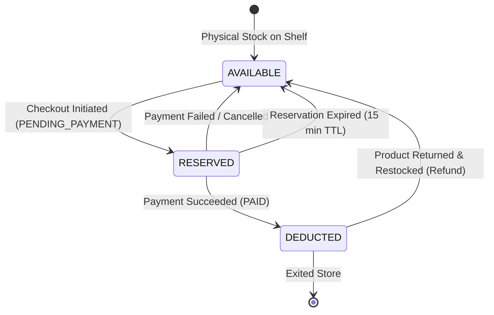
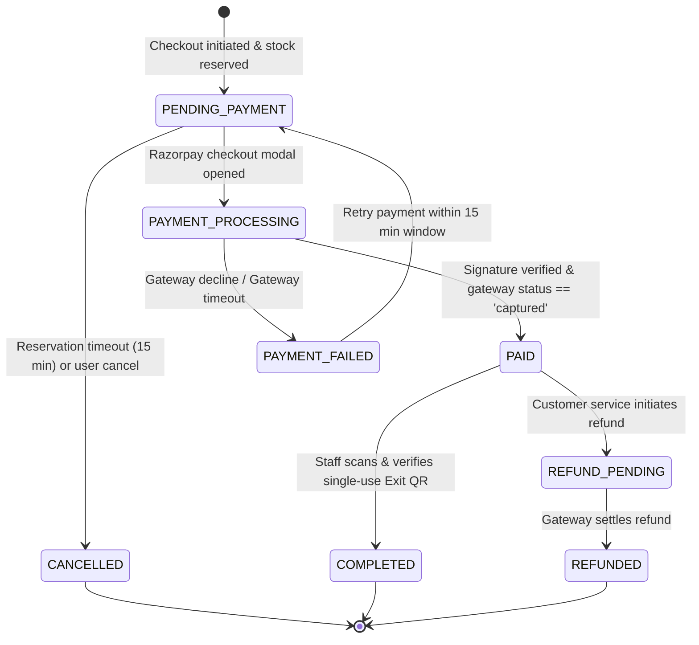
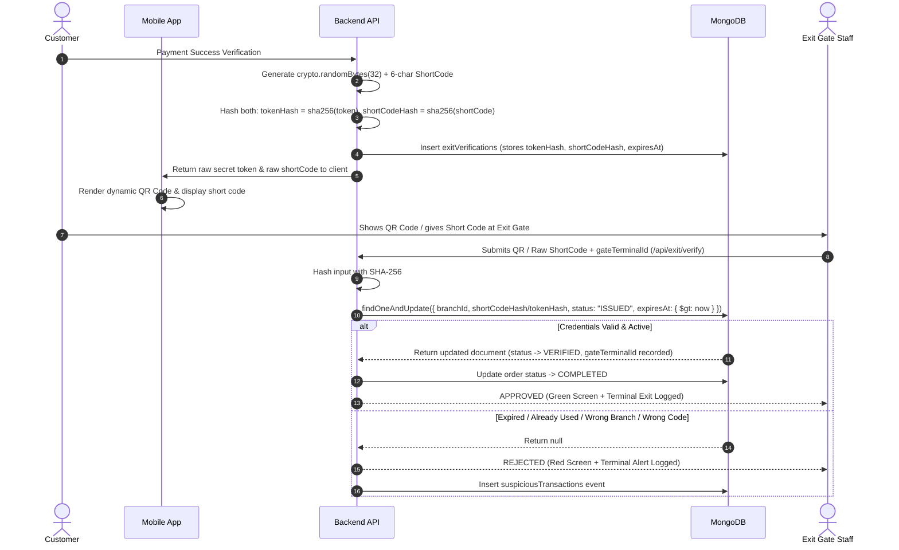

# SmartScan & Pay — Production Database Design Specification

**Document Version:** 2.1  
**Status:** Approved for Architecture Phase (Final Hardened Specification)  
**Database Engine:** MongoDB (v6.0+ / MongoDB Atlas)  
**Target ODM:** Mongoose (Node.js)  
**Specification Reference:** `PROJECT_REQUIREMENTS.md`

---

## Table of Contents

1. [Architectural Core Directives & Monetary Standard](#1-architectural-core-directives--monetary-standard)
2. [Collection Overview](#2-collection-overview)
3. [users Collection](#3-users-collection)
4. [supermarkets Collection](#4-supermarkets-collection)
5. [branches Collection](#5-branches-collection)
6. [products Collection](#6-products-collection)
7. [barcodes Collection (Global Barcode Uniqueness)](#7-barcodes-collection)
8. [inventories Collection (Branch Stock & Pricing)](#8-inventories-collection)
9. [carts Collection](#9-carts-collection)
10. [orders Collection](#10-orders-collection)
11. [payments Collection](#11-payments-collection)
12. [coupons Collection](#12-coupons-collection)
13. [couponRedemptions Collection (Scalable Voucher Tracking)](#13-couponredemptions-collection)
14. [exitVerifications Collection (Hardened Dual-Hash Architecture)](#14-exitverifications-collection)
15. [Supporting Collections (refunds, suspiciousTransactions, auditLogs)](#15-supporting-collections)
16. [Relationships Between Collections](#16-relationships-between-collections)
17. [Fields and Data Types](#17-fields-and-data-types)
18. [Required vs Optional Fields](#18-required-vs-optional-fields)
19. [Embedded vs Referenced Data Decisions](#19-embedded-vs-referenced-data-decisions)
20. [Consolidated Index Architecture (Unique & Performance)](#20-consolidated-index-architecture)
21. [Barcode Strategy & Collision Elimination](#21-barcode-strategy--collision-elimination)
22. [Branch & Inventory Strategy (Complete Reservation Lifecycle)](#22-branch--inventory-strategy)
23. [Pricing Strategy & Server Authority](#23-pricing-strategy--server-authority)
24. [Cart Strategy](#24-cart-strategy)
25. [Order Lifecycle](#25-order-lifecycle)
26. [Payment Lifecycle & Authoritative Gateway State Verification](#26-payment-lifecycle--authoritative-gateway-state-verification)
27. [MongoDB Transaction Boundaries & State Machine Architecture](#27-mongodb-transaction-boundaries--state-machine-architecture)
28. [Coupon Strategy & Scalable Redemptions](#28-coupon-strategy--scalable-redemptions)
29. [Refund Strategy](#29-refund-strategy)
30. [Exit Verification Strategy (Dual-Hash & Gate Terminal Scoping)](#30-exit-verification-strategy)
31. [Audit Requirements](#31-audit-requirements)
32. [Security Considerations](#32-security-considerations)
33. [Scalability Considerations](#33-scalability-considerations)
34. [Data Consistency, Concurrency & Invariants](#34-data-consistency-concurrency--invariants)

---

# 1. Architectural Core Directives & Monetary Standard

### 1.1 Strict Monetary Representation: Integer Paise Standard
> [!IMPORTANT]
> **Zero Floating-Point Tolerance:**
> Floating-point numbers (`IEEE 754`) introduce dangerous precision rounding artifacts (e.g. `0.1 + 0.2 === 0.30000000000000004`). In financial transactions, this leads to accounting drift and signature mismatches with payment gateways.
> 
> **Standard:**
> * **ALL** monetary values across the entire database, APIs, and business logic are represented exclusively as **integer paise** (1 INR = 100 paise).
> * No floating-point values are permitted as an alternative.
> * Fields ending with `...Paise` explicitly denote this unit.
> * Conversion Example: `₹49.50` is stored as integer `4950`; `₹1,200.00` is stored as integer `120000`.
> * Covers: MRP, selling prices, line item subtotals, tax amounts, item discounts, coupon discounts, gross totals, final payable amounts, Razorpay payment amounts, and refund amounts.

---

# 2. Collection Overview

The architecture divides responsibilities across 15 purpose-built collections to guarantee linear horizontal scalability, strict indexing, and zero cross-branch contention:

| Collection Name | Primary Purpose | Growth Profile | Retention Policy |
| :--- | :--- | :--- | :--- |
| `users` | Customers, Branch Staff, Managers, and Super Admins | Moderate | Permanent |
| `supermarkets` | Multi-tenant supermarket corporate entities | Low | Permanent |
| `branches` | Physical store locations and branch-specific configurations | Low | Permanent |
| `products` | Master global catalog definition (descriptions, images, units) | High | Permanent (Soft delete) |
| `barcodes` | Cross-document, system-wide unique barcode registry | High | Permanent |
| `inventories` | Branch-specific stock, reservations, and paise selling prices | Very High | Permanent |
| `carts` | Transient customer shopping sessions bound to a branch | High (churn) | TTL: 7 days after expiry |
| `orders` | Authoritative order records with immutable product snapshots | Very High | Permanent (Financial) |
| `payments` | Razorpay payment intents, signatures, and verified transactions | Very High | Permanent (Financial) |
| `coupons` | Promotion voucher definitions, dates, and rule configurations | Moderate | Permanent |
| `couponRedemptions` | Normalized per-user/per-order coupon redemption ledger | High | Permanent |
| `exitVerifications` | Cryptographically hashed single-use digital exit tokens | High | TTL: 30 days after expiry |
| `refunds` | Full and partial refund requests and gateway refund tracking | Moderate | Permanent (Financial) |
| `suspiciousTransactions` | Telemetry log of anomalous scanning, payment, or exit events | Moderate | 1 year rolling |
| `auditLogs` | Administrative mutations (price updates, manual stock shifts) | Very High | 3 years (Compliance) |

---

# 3. `users` Collection

### Purpose
Stores all human actors across the platform. Implements Role-Based Access Control (RBAC) and branch assignment scoping.

### Schema Specification

```javascript
{
  _id: ObjectId,
  name: { type: String, required: true, trim: true },
  email: { type: String, required: false, lowercase: true, trim: true },
  phone: { type: String, required: true, trim: true }, // E.164 format (+91...)
  passwordHash: { type: String, required: true }, // bcrypt hashed (min 12 salt rounds)
  role: { 
    type: String, 
    required: true, 
    enum: ["CUSTOMER", "BRANCH_STAFF", "BRANCH_MANAGER", "SUPER_ADMIN"],
    default: "CUSTOMER"
  },
  status: { 
    type: String, 
    required: true, 
    enum: ["ACTIVE", "INACTIVE", "SUSPENDED"], 
    default: "ACTIVE" 
  },
  assignedSupermarketId: { 
    type: ObjectId, 
    ref: "supermarkets", 
    required: function() { return ["BRANCH_STAFF", "BRANCH_MANAGER"].includes(this.role); }
  },
  assignedBranchIds: [{ 
    type: ObjectId, 
    ref: "branches" 
  }], // Empty for CUSTOMER/SUPER_ADMIN; Exactly 1 for BRANCH_STAFF; 1+ for BRANCH_MANAGER
  failedLoginAttempts: { type: Number, default: 0 },
  lockUntil: { type: Date, default: null },
  lastLoginAt: { type: Date, default: null },
  createdAt: { type: Date, default: Date.now },
  updatedAt: { type: Date, default: Date.now }
}
```

### Validation & Security Rules
* `phone`: Validated with standard regex `^\+[1-9]\d{1,14}$`.
* `passwordHash`: Never returned in default projection queries (`select: false`).
* `assignedBranchIds`: Mandatory if `role` is `BRANCH_STAFF` (max length 1) or `BRANCH_MANAGER`.
* `lockUntil`: When current time < `lockUntil`, rejects authentication immediately.

### Indexes
* `{ phone: 1 }` — **Unique** (primary customer & staff identifier).
* `{ email: 1 }` — **Unique, Sparse** (optional for customers, mandatory for admins).
* `{ role: 1 }` — Filter performance for administrative dashboards.
* `{ assignedBranchIds: 1 }` — Multikey index for branch authorization checks.

---

# 4. `supermarkets` Collection

### Purpose
Represents the parent corporate entity or supermarket chain (multi-tenancy root).

### Schema Specification

```javascript
{
  _id: ObjectId,
  name: { type: String, required: true, trim: true },
  code: { type: String, required: true, uppercase: true, trim: true }, // e.g. "SMARTMART"
  logoUrl: { type: String, default: null },
  contactEmail: { type: String, required: true, trim: true },
  contactPhone: { type: String, required: true, trim: true },
  taxIdentificationNumber: { type: String, required: true, trim: true }, // GSTIN/Tax ID
  currency: { type: String, required: true, default: "INR" },
  status: { type: String, enum: ["ACTIVE", "INACTIVE"], default: "ACTIVE" },
  settings: {
    allowSelfCheckout: { type: Boolean, default: true },
    maxCartItemLimit: { type: Number, default: 50 },
    requireStaffExitVerification: { type: Boolean, default: true }
  },
  createdAt: { type: Date, default: Date.now },
  updatedAt: { type: Date, default: Date.now }
}
```

### Indexes
* `{ code: 1 }` — **Unique** tenant identifier.
* `{ status: 1 }` — Active supermarket filtering.

---

# 5. `branches` Collection

### Purpose
Physical store locations where customer scanning, inventory management, and exit verification occur.

### Schema Specification

```javascript
{
  _id: ObjectId,
  supermarketId: { type: ObjectId, ref: "supermarkets", required: true },
  branchCode: { type: String, required: true, uppercase: true, trim: true }, // e.g., "BLR-INDIRA-01"
  name: { type: String, required: true, trim: true }, // e.g., "Indiranagar Flagship"
  address: {
    street: { type: String, required: true },
    city: { type: String, required: true },
    state: { type: String, required: true },
    postalCode: { type: String, required: true },
    country: { type: String, required: true, default: "India" },
    location: {
      type: { type: String, enum: ["Point"], default: "Point" },
      coordinates: { type: [Number], required: true } // [longitude, latitude]
    }
  },
  contactPhone: { type: String, required: true },
  contactEmail: { type: String, required: true },
  isActive: { type: Boolean, default: true },
  operatingHours: {
    openTime: { type: String, required: true, default: "07:00" }, // HH:mm
    closeTime: { type: String, required: true, default: "22:00" }
  },
  settings: {
    exitTokenExpiryMinutes: { type: Number, default: 20, min: 5, max: 60 },
    reservationExpiryMinutes: { type: Number, default: 15, min: 5, max: 30 }, // Unpaid order timeout
    geofenceRadiusMeters: { type: Number, default: 300 }
  },
  createdAt: { type: Date, default: Date.now },
  updatedAt: { type: Date, default: Date.now }
}
```

### Indexes
* `{ supermarketId: 1, branchCode: 1 }` — **Unique Compound** (branch code unique per chain).
* `{ "address.location": "2dsphere" }` — Geospatial lookup for nearby stores.
* `{ "address.city": 1, isActive: 1 }` — Regional branch selection.

---

# 6. `products` Collection

### Purpose
Master global catalog document defining universal product characteristics. Does NOT store branch stock or branch selling prices.

### Schema Specification

```javascript
{
  _id: ObjectId,
  supermarketId: { type: ObjectId, ref: "supermarkets", required: true },
  name: { type: String, required: true, trim: true },
  brand: { type: String, required: true, trim: true },
  category: { type: String, required: true, trim: true },
  subCategory: { type: String, default: null, trim: true },
  description: { type: String, default: "" },
  images: [{
    url: { type: String, required: true },
    isPrimary: { type: Boolean, default: false }
  }],
  baseBarcode: { type: String, required: true, trim: true }, // Master packaging barcode
  additionalBarcodes: [{ type: String, trim: true }], // Variant or multi-pack aliases
  unit: { 
    type: String, 
    required: true, 
    enum: ["PCS", "KG", "G", "L", "ML", "PACK"],
    default: "PCS"
  },
  defaultPricePaise: { type: Number, required: true, min: 0 }, // Baseline MRP catalog price in paise
  taxRatePercent: { type: Number, required: true, default: 0, min: 0, max: 28 },
  hsnCode: { type: String, default: null },
  isActive: { type: Boolean, default: true },
  createdAt: { type: Date, default: Date.now },
  updatedAt: { type: Date, default: Date.now }
}
```

### Indexes
* `{ supermarketId: 1, name: "text", brand: "text" }` — Full-text search for catalog administration.
* `{ category: 1, isActive: 1 }` — Category listing index.

---

# 7. `barcodes` Collection

### Purpose
Solves the cross-document, cross-field barcode collision challenge at the database storage engine level. Guarantees that **no barcode can ever be simultaneously assigned** as:
1. Another product's `baseBarcode`.
2. Another product's `additionalBarcode`.
3. A product's `baseBarcode` and another product's `additionalBarcode`.

### Schema Specification

```javascript
{
  _id: ObjectId,
  barcode: { type: String, required: true, trim: true }, // The barcode string scanned by camera
  productId: { type: ObjectId, ref: "products", required: true },
  supermarketId: { type: ObjectId, ref: "supermarkets", required: true },
  barcodeType: { 
    type: String, 
    required: true, 
    enum: ["BASE", "ADDITIONAL"] 
  },
  isActive: { type: Boolean, default: true },
  createdAt: { type: Date, default: Date.now }
}
```

### Index Architecture
* `{ barcode: 1 }` — **Global Unique Index**.
  * Any attempt to register an existing barcode—regardless of whether it is being registered as `BASE` or `ADDITIONAL` on any product—is rejected with a MongoDB `11000 E11000 duplicate key error`.
* `{ productId: 1 }` — Reverse lookup to retrieve all barcodes assigned to a product.

---

# 8. `inventories` Collection

### Purpose
Represents localized physical stock and authoritative pricing at a specific supermarket branch.

### Schema Specification

```javascript
{
  _id: ObjectId,
  branchId: { type: ObjectId, ref: "branches", required: true },
  productId: { type: ObjectId, ref: "products", required: true },
  supermarketId: { type: ObjectId, ref: "supermarkets", required: true },
  
  // Authoritative Branch Financials (Strict Integer Paise Standard)
  mrpPaise: { type: Number, required: true, min: 0 }, // Printed Maximum Retail Price in paise
  sellingPricePaise: { type: Number, required: true, min: 0 }, // Authoritative store selling price in paise
  specialOfferPricePaise: { type: Number, default: null, min: 0 }, // Promo override in paise
  
  // Concurrency-Safe Stock Tracking
  stockQuantity: { type: Number, required: true, min: 0, default: 0 }, // Real physical stock in store
  reservedStock: { type: Number, required: true, min: 0, default: 0 }, // In active checkout / pending payment
  lowStockThreshold: { type: Number, default: 5 },
  
  // Store Logistics
  aisleLocation: { type: String, default: null }, // e.g., "Aisle 4 - Shelf B"
  isAvailable: { type: Boolean, default: true },
  
  // Optimistic Concurrency Control
  version: { type: Number, default: 0 }, // Incremented on stock mutations
  
  lastRestockedAt: { type: Date, default: null },
  lastPriceUpdatedAt: { type: Date, default: Date.now },
  updatedBy: { type: ObjectId, ref: "users" }, // Audit actor ID
  createdAt: { type: Date, default: Date.now },
  updatedAt: { type: Date, default: Date.now }
}
```

### Validation Invariants
* `sellingPricePaise` <= `mrpPaise` (strictly enforced; pricing above MRP is illegal in retail).
* `stockQuantity` >= 0 (strictly enforced; prevents negative inventory under high concurrency).
* `reservedStock` <= `stockQuantity`.
* Effective available stock: `availableStock = stockQuantity - reservedStock`.

### Indexes
* `{ branchId: 1, productId: 1 }` — **Unique Compound Index** (exactly one inventory doc per product per store).
* `{ branchId: 1, isAvailable: 1, stockQuantity: 1 }` — Fast shelf availability check.
* `{ branchId: 1, stockQuantity: 1 }` — Low-stock threshold alerting.

---

# 9. `carts` Collection

### Purpose
Maintains customer active shopping bags. Binds a customer session directly to one specific supermarket branch.

### Schema Specification

```javascript
{
  _id: ObjectId,
  customerId: { type: ObjectId, ref: "users", required: true },
  supermarketId: { type: ObjectId, ref: "supermarkets", required: true },
  branchId: { type: ObjectId, ref: "branches", required: true },
  items: [{
    productId: { type: ObjectId, ref: "products", required: true },
    barcode: { type: String, required: true },
    quantity: { type: Number, required: true, min: 1, max: 20 },
    addedAtPricePaise: { type: Number, required: true, min: 0 }, // Display cache only; revalidated at checkout
    addedAt: { type: Date, default: Date.now }
  }],
  appliedCouponId: { type: ObjectId, ref: "coupons", default: null },
  status: { 
    type: String, 
    required: true, 
    enum: ["ACTIVE", "ABANDONED", "CHECKED_OUT"], 
    default: "ACTIVE" 
  },
  expiresAt: { type: Date, required: true }, // TTL expiration (default: 4 hours of inactivity)
  createdAt: { type: Date, default: Date.now },
  updatedAt: { type: Date, default: Date.now }
}
```

### Business Rules
* **Zero-Trust Client Pricing:** `addedAtPricePaise` is cached purely for responsive UI display. The backend **never** computes final payable totals from this value. Checkout always executes an authoritative fresh read against `inventories.sellingPricePaise`.
* **Single Active Cart Guarantee:** A customer can have at most one `ACTIVE` cart across the platform.

### Indexes
* `{ customerId: 1 }` — **Unique Partial Filter Index** where `status: "ACTIVE"`. Guarantees a customer cannot maintain simultaneous open carts.
* `{ expiresAt: 1 }` — **TTL Index** (`expireAfterSeconds: 0`) automatically purges abandoned stale carts.

---

# 10. `orders` Collection

### Purpose
Authoritative, immutable transaction record for every checkout attempt. Captures complete financial snapshots, tax breakouts, payment association, and exit status.

### Snapshotting Strategy (Historical Immutability)
Every line item in `orders.items` is a **complete, self-contained embedded snapshot**:
* `name`, `brand`, `barcode`, `unit`
* `unitPricePaise` (exact branch selling price authoritative at the second of checkout)
* `mrpPaise`
* `quantity`
* `taxRatePercent` and calculated `taxAmountPaise`
* Line item `discountAmountPaise`, `subtotalPaise`, and `totalPaise`

Once an order document transitions to `PAID`, its items array becomes **read-only and mathematically sealed**.

### Schema Specification

```javascript
{
  _id: ObjectId,
  orderNumber: { type: String, required: true }, // e.g., "SSP-20260910-89104"
  customerId: { type: ObjectId, ref: "users", required: true },
  supermarketId: { type: ObjectId, ref: "supermarkets", required: true },
  branchId: { type: ObjectId, ref: "branches", required: true },
  cartId: { type: ObjectId, ref: "carts", required: true },
  
  // Immutable Product Snapshot (All Financials in Integer Paise)
  items: [{
    productId: { type: ObjectId, ref: "products", required: true },
    barcode: { type: String, required: true },
    name: { type: String, required: true },
    brand: { type: String, required: true },
    unit: { type: String, required: true },
    mrpPaise: { type: Number, required: true, min: 0 },
    unitPricePaise: { type: Number, required: true, min: 0 }, // Authoritative checkout price in paise
    quantity: { type: Number, required: true, min: 1 },
    taxRatePercent: { type: Number, required: true, default: 0 },
    taxAmountPaise: { type: Number, required: true, default: 0 },
    discountAmountPaise: { type: Number, default: 0 },
    subtotalPaise: { type: Number, required: true }, // (unitPricePaise * quantity)
    totalPaise: { type: Number, required: true } // subtotalPaise + taxAmountPaise - discountAmountPaise
  }],
  
  // Authoritative Financial Summary (Integer Paise Standard)
  pricingSummary: {
    itemsGrossTotalPaise: { type: Number, required: true }, // Sum of (mrpPaise * qty)
    itemsSellingTotalPaise: { type: Number, required: true }, // Sum of (unitPricePaise * qty)
    totalItemDiscountPaise: { type: Number, default: 0 }, // Gross - Selling
    couponDiscountAmountPaise: { type: Number, default: 0 },
    totalTaxAmountPaise: { type: Number, required: true, default: 0 },
    finalPayableAmountPaise: { type: Number, required: true, min: 1 }, // Exact amount sent to Razorpay
    currency: { type: String, required: true, default: "INR" }
  },
  
  // Coupon Snapshot
  appliedCoupon: {
    couponId: { type: ObjectId, ref: "coupons", default: null },
    code: { type: String, default: null },
    discountType: { type: String, enum: ["PERCENTAGE", "FLAT"], default: null },
    discountValue: { type: Number, default: 0 } // Percentage value OR flat amount in paise
  },
  
  // Order Lifecycle State
  status: { 
    type: String, 
    required: true, 
    enum: [
      "PENDING_PAYMENT", 
      "PAYMENT_PROCESSING", 
      "PAID", 
      "PAYMENT_FAILED", 
      "CANCELLED", 
      "REFUND_PENDING", 
      "REFUNDED", 
      "COMPLETED"
    ],
    default: "PENDING_PAYMENT"
  },
  
  paymentId: { type: ObjectId, ref: "payments", default: null },
  exitVerificationId: { type: ObjectId, ref: "exitVerifications", default: null },
  
  // Fraud & Suspicious Activity Flags
  paymentAttemptsCount: { type: Number, default: 0 },
  isSuspicious: { type: Boolean, default: false },
  suspiciousReasons: [{ type: String }],
  
  // Audit Context
  clientMetadata: {
    ipAddress: { type: String, default: null },
    userAgent: { type: String, default: null },
    deviceFingerprint: { type: String, default: null }
  },
  
  reservationExpiresAt: { type: Date, required: true }, // Stock reservation release deadline (15 min)
  cancellationReason: { type: String, default: null },
  paidAt: { type: Date, default: null },
  completedAt: { type: Date, default: null }, // Staff exit verification timestamp
  createdAt: { type: Date, default: Date.now },
  updatedAt: { type: Date, default: Date.now }
}
```

### Indexes
* `{ orderNumber: 1 }` — **Unique Index**.
* `{ customerId: 1, status: 1, createdAt: -1 }` — Customer order history.
* `{ branchId: 1, status: 1, createdAt: -1 }` — Branch manager orders dashboard.
* `{ cartId: 1 }` — **Partial Unique Index** where `status: "PENDING_PAYMENT"` (prevents multiple unpaid orders for the same cart session).
* `{ status: 1, reservationExpiresAt: 1 }` — Background reservation cleanup worker index.

---

# 11. `payments` Collection

### Purpose
Dedicated financial transaction record storing Razorpay order parameters, verification signatures, gateway webhook responses, and idempotency tokens.

### Schema Specification

```javascript
{
  _id: ObjectId,
  orderId: { type: ObjectId, ref: "orders", required: true },
  customerId: { type: ObjectId, ref: "users", required: true },
  branchId: { type: ObjectId, ref: "branches", required: true },
  supermarketId: { type: ObjectId, ref: "supermarkets", required: true },
  
  // Gateway Identification
  gateway: { type: String, required: true, default: "RAZORPAY" },
  razorpayOrderId: { type: String, required: true }, // Gateway order ID (order_xxxx)
  razorpayPaymentId: { type: String, default: null }, // Gateway payment ID (pay_xxxx)
  razorpaySignature: { type: String, default: null }, // HMAC-SHA256 signature
  
  // Financial Verification (Strict Integer Paise Standard)
  amountPaise: { type: Number, required: true, min: 1 }, // Exact amount in paise (100 INR = 10000)
  currency: { type: String, required: true, default: "INR" },
  
  status: {
    type: String,
    required: true,
    enum: ["CREATED", "AUTHORIZED", "CAPTURED", "FAILED", "REFUNDED"],
    default: "CREATED"
  },
  
  paymentMethod: {
    methodType: { type: String, default: null }, // "upi", "card", "netbanking", "wallet"
    bank: { type: String, default: null },
    wallet: { type: String, default: null },
    vpa: { type: String, default: null } // Masked UPI ID
  },
  
  // Verification Integrity & Idempotency
  idempotencyKey: { type: String, required: true }, // UUID preventing duplicate webhook execution
  isServerVerified: { type: Boolean, default: false },
  verifiedAt: { type: Date, default: null },
  rawGatewayResponse: { type: Object, default: null }, // Parsed JSON webhook payload for audits
  
  errorCode: { type: String, default: null },
  errorDescription: { type: String, default: null },
  
  createdAt: { type: Date, default: Date.now },
  updatedAt: { type: Date, default: Date.now }
}
```

> [!CRITICAL]
> **Authoritative Gateway State Verification Rule:**
> * For the MVP, **ONLY** `gatewayResponse.status === "captured"` may transition the payment to `CAPTURED` and the order to `PAID`.
> * Gateway status `"authorized"` is **NOT** treated as equivalent to `"captured"`. If the gateway reports `"authorized"`, the payment is recorded as `AUTHORIZED` and the order remains in `PAYMENT_PROCESSING`. The order **must NOT become `PAID`** unless and until the payment is captured either via automated server-side capture or via a verified `payment.captured` webhook.

### Indexes
* `{ idempotencyKey: 1 }` — **Unique Index**.
* `{ razorpayPaymentId: 1 }` — **Unique Sparse Index** (eliminates duplicate payment recording).
* `{ razorpayOrderId: 1 }` — Webhook lookup index.
* `{ orderId: 1 }` — Reverse lookup linking to parent order.

---

# 12. `coupons` Collection

### Purpose
Stores promotional voucher rules, validity windows, and discount caps. Does NOT store growing user redemption arrays.

### Schema Specification

```javascript
{
  _id: ObjectId,
  code: { type: String, required: true, uppercase: true, trim: true }, // e.g. "WELCOME50"
  supermarketId: { type: ObjectId, ref: "supermarkets", required: true },
  applicableBranchIds: [{ type: ObjectId, ref: "branches" }], // Empty array = chain-wide
  description: { type: String, required: true },
  
  discountType: { 
    type: String, 
    required: true, 
    enum: ["PERCENTAGE", "FLAT"] 
  },
  discountValue: { type: Number, required: true, min: 1 }, // Percentage integer (e.g. 20) OR flat amount in paise (e.g. 5000)
  maxDiscountAmountPaise: { type: Number, default: null, min: 0 }, // Percentage discount cap in paise
  minOrderAmountPaise: { type: Number, required: true, default: 0, min: 0 }, // Minimum order total in paise
  
  usageLimitTotal: { type: Number, default: 1000 }, // Max global redemptions
  usageLimitPerUser: { type: Number, default: 1 }, // Limit per customer
  totalUsedCount: { type: Number, default: 0 }, // Atomic counter incremented upon payment
  
  startDate: { type: Date, required: true },
  endDate: { type: Date, required: true },
  isActive: { type: Boolean, default: true },
  
  createdAt: { type: Date, default: Date.now },
  updatedAt: { type: Date, default: Date.now }
}
```

### Indexes
* `{ code: 1 }` — **Unique Index**.
* `{ supermarketId: 1, isActive: 1, endDate: 1 }` — Active coupon query filter.

---

# 13. `couponRedemptions` Collection

### Purpose
Production-scalable normalized collection recording every coupon redemption. Eliminates the anti-pattern of embedding unbounded arrays inside `coupons`.

### Schema Specification

```javascript
{
  _id: ObjectId,
  couponId: { type: ObjectId, ref: "coupons", required: true },
  customerId: { type: ObjectId, ref: "users", required: true },
  orderId: { type: ObjectId, ref: "orders", required: true },
  supermarketId: { type: ObjectId, ref: "supermarkets", required: true },
  branchId: { type: ObjectId, ref: "branches", required: true },
  discountAmountPaise: { type: Number, required: true, min: 1 },
  redeemedAt: { type: Date, default: Date.now }
}
```

### Index Architecture
* `{ orderId: 1 }` — **Unique Index**. Guarantees an order can never redeem more than one coupon or process duplicate redemptions.
* `{ couponId: 1, customerId: 1 }` — Query index used to count per-user redemptions (`countDocuments <= coupon.usageLimitPerUser`).
* `{ couponId: 1, redeemedAt: -1 }` — Admin reporting and audit trail.

---

# 14. `exitVerifications` Collection

### Purpose
Implements the single-use, cryptographically secure digital gatepass presented to branch staff at the physical store exit gate.

### Dual-Hash Security & Gate Terminal Scoping
> [!IMPORTANT]
> **Zero Plaintext Credentials in Storage:**
> 1. **Primary QR Token:** A 256-bit CSPRNG string (`crypto.randomBytes(32)`), stored exclusively as its **SHA-256 digest (`tokenHash`)**.
> 2. **Fallback Short Code:** A 6-character Crockford Base32 alphanumeric code displayed to the user for manual entry if the phone screen is broken. The raw code is **NEVER stored in plaintext** in the database; it is stored exclusively as its **SHA-256 digest (`shortCodeHash`)**.
> 3. **Gate Terminal Auditing:** The physical gate terminal ID (`gateTerminalId`) records exactly which physical barrier terminal or staff handheld device authorized the exit.

### Schema Specification

```javascript
{
  _id: ObjectId,
  orderId: { type: ObjectId, ref: "orders", required: true },
  customerId: { type: ObjectId, ref: "users", required: true },
  branchId: { type: ObjectId, ref: "branches", required: true },
  supermarketId: { type: ObjectId, ref: "supermarkets", required: true },
  
  tokenHash: { type: String, required: true }, // SHA-256 hash of the 256-bit QR token
  shortCodeHash: { type: String, required: true }, // SHA-256 hash of the 6-character fallback code
  
  status: { 
    type: String, 
    required: true, 
    enum: ["ISSUED", "VERIFIED", "EXPIRED", "REVOKED"], 
    default: "ISSUED" 
  },
  
  expiresAt: { type: Date, required: true }, // Order paid time + branch expiry setting (e.g. 20 min)
  verifiedAt: { type: Date, default: null },
  verifiedByStaffId: { type: ObjectId, ref: "users", default: null }, // Staff member who verified
  gateTerminalId: { type: String, default: null }, // Physical exit terminal ID (e.g., "GATE-NORTH-01")
  
  scanAttempts: { type: Number, default: 0 },
  rejectionReason: { type: String, default: null },
  
  createdAt: { type: Date, default: Date.now },
  updatedAt: { type: Date, default: Date.now }
}
```

### Indexes
* `{ tokenHash: 1 }` — **Unique Index**.
* `{ orderId: 1 }` — **Unique Index** (exactly 1 exit record per order).
* `{ branchId: 1, shortCodeHash: 1 }` — Manual code fallback lookup scoped to branch using the hashed code.
* `{ branchId: 1, status: 1 }` — Staff live gate activity feed.
* `{ expiresAt: 1 }` — Expiry evaluation & TTL indexing.

---

# 15. Supporting Collections

### 15.1 `refunds` Collection
```javascript
{
  _id: ObjectId,
  refundNumber: { type: String, required: true }, // "REF-20260910-001"
  orderId: { type: ObjectId, ref: "orders", required: true },
  paymentId: { type: ObjectId, ref: "payments", required: true },
  branchId: { type: ObjectId, ref: "branches", required: true },
  customerId: { type: ObjectId, ref: "users", required: true },
  amountPaise: { type: Number, required: true, min: 1 }, // Integer paise
  reason: { type: String, required: true },
  status: { type: String, enum: ["PENDING", "PROCESSED", "FAILED"], default: "PENDING" },
  gatewayRefundId: { type: String, default: null }, // Razorpay refund ID (rfnd_xxxx)
  isStockRestocked: { type: Boolean, default: false },
  initiatedBy: { type: ObjectId, ref: "users", required: true },
  createdAt: { type: Date, default: Date.now },
  updatedAt: { type: Date, default: Date.now }
}
```
* **Indexes:** `{ refundNumber: 1 }` (unique), `{ gatewayRefundId: 1 }` (unique, sparse), `{ orderId: 1 }`.

### 15.2 `suspiciousTransactions` Collection
```javascript
{
  _id: ObjectId,
  eventType: { 
    type: String, 
    required: true,
    enum: [
      "PAYMENT_AMOUNT_MISMATCH",
      "REPEATED_PAYMENT_FAILURE",
      "RAPID_BARCODE_SCANNING",
      "ABNORMAL_QUANTITY_ATTEMPT",
      "INVALID_EXIT_TOKEN_SCAN",
      "REUSED_EXIT_TOKEN_ATTEMPT",
      "PRICE_TAMPER_ATTEMPT",
      "MANUAL_CODE_BRUTE_FORCE_ATTEMPT"
    ]
  },
  severity: { type: String, enum: ["LOW", "MEDIUM", "HIGH", "CRITICAL"], required: true },
  customerId: { type: ObjectId, ref: "users", default: null },
  orderId: { type: ObjectId, ref: "orders", default: null },
  branchId: { type: ObjectId, ref: "branches", required: true },
  telemetry: {
    ipAddress: String,
    userAgent: String,
    gateTerminalId: String,
    details: Object
  },
  isResolved: { type: Boolean, default: false },
  resolvedBy: { type: ObjectId, ref: "users", default: null },
  resolutionNotes: { type: String, default: null },
  createdAt: { type: Date, default: Date.now }
}
```
* **Indexes:** `{ branchId: 1, severity: 1, isResolved: 1 }`, `{ createdAt: -1 }`.

### 15.3 `auditLogs` Collection
```javascript
{
  _id: ObjectId,
  action: { 
    type: String, 
    required: true,
    enum: ["PRICE_UPDATE", "STOCK_ADJUSTMENT", "COUPON_CREATE", "USER_ROLE_CHANGE", "ORDER_REFUND", "EXIT_OVERRIDE"]
  },
  actorId: { type: ObjectId, ref: "users", required: true },
  actorRole: { type: String, required: true },
  branchId: { type: ObjectId, ref: "branches", default: null },
  gateTerminalId: { type: String, default: null },
  targetCollection: { type: String, required: true },
  targetDocumentId: { type: ObjectId, required: true },
  beforeSnapshot: { type: Object, default: null },
  afterSnapshot: { type: Object, default: null },
  ipAddress: { type: String, default: null },
  createdAt: { type: Date, default: Date.now }
}
```
* **Indexes:** `{ targetCollection: 1, targetDocumentId: 1 }`, `{ actorId: 1, createdAt: -1 }`.

---

# 16. Relationships Between Collections

```mermaid
erDiagram
    supermarkets ||--o{ branches : owns
    supermarkets ||--o{ products : defines
    supermarkets ||--o{ coupons : issues
    supermarkets ||--o{ users : employs
    
    products ||--o{ barcodes : registers
    
    branches ||--o{ inventories : stocks
    products ||--o{ inventories : mapped_to
    
    users ||--o{ carts : creates
    branches ||--o{ carts : hosts
    
    carts ||--o{ orders : converts_to
    branches ||--o{ orders : fulfills
    users ||--o{ orders : places
    
    orders ||--|| payments : verified_by
    orders ||--|| exitVerifications : unlocks
    orders ||--o{ refunds : can_have
    orders ||--o{ couponRedemptions : logs
    coupons ||--o{ couponRedemptions : tracks
    
    orders ||--o{ suspiciousTransactions : flags
    users ||--o{ auditLogs : generates
```



### Cardinality Mapping

| Entity A | Relationship | Entity B | Cardinality | Implementation Strategy |
| :--- | :---: | :--- | :---: | :--- |
| `products` | 1 to N | `barcodes` | 1 : N | Referenced via `productId` with unique index on `barcodes.barcode` |
| `branches` | N to M | `products` | N : M | Normalized linking table via `inventories` |
| `users` (Customer) | 1 to 1 | `carts` | 1 : 1 (Active) | Partial Unique Index on `customerId` where `status: "ACTIVE"` |
| `carts` | 1 to N | `cart.items` | 1 : N | **Embedded Document Array** (high performance single-trip fetch) |
| `orders` | 1 to N | `order.items` | 1 : N | **Embedded Document Array** (immutable historical snapshot) |
| `orders` | 1 to 1 | `payments` | 1 : 1 | Referenced via `orderId` with Unique index on payment side |
| `orders` | 1 to 1 | `exitVerifications` | 1 : 1 | Referenced via `orderId` with Unique index |
| `coupons` | 1 to N | `couponRedemptions` | 1 : N | Normalized collection linked via `couponId` and `orderId` |

---

# 17. Fields and Data Types

| Data Type | Primary MongoDB Usage | Examples |
| :--- | :--- | :--- |
| `ObjectId` | Primary keys and relational references | `_id`, `supermarketId`, `branchId`, `productId` |
| `String` | Human-readable identifiers, hashes, codes, enums | `orderNumber`, `tokenHash`, `shortCodeHash`, `gateTerminalId`, `barcode`, `role` |
| `Number` (Integer) | **ALL monetary values in paise**; quantities, counters | `sellingPricePaise`, `finalPayableAmountPaise`, `stockQuantity` |
| `Boolean` | Toggles, soft-deletion flags, verification flags | `isActive`, `isAvailable`, `isServerVerified` |
| `Date` | Timestamps, TTL expirations, reservation deadlines | `createdAt`, `expiresAt`, `reservationExpiresAt` |
| `Array` | Snapshot subdocuments, branch assignment lists | `items`, `assignedBranchIds`, `suspiciousReasons` |
| `Object` | Raw gateway webhook payloads, audit before/after | `rawGatewayResponse`, `telemetry`, `beforeSnapshot` |

---

# 18. Required vs Optional Fields

| Collection | Strict Mandatory Fields | Optional / System-Computed Fields |
| :--- | :--- | :--- |
| `users` | `name`, `phone`, `passwordHash`, `role`, `status` | `email`, `assignedSupermarketId`, `assignedBranchIds`, `lockUntil` |
| `branches` | `supermarketId`, `branchCode`, `name`, `address.*`, `contactPhone` | `settings.exitTokenExpiryMinutes`, `operatingHours` |
| `products` | `supermarketId`, `name`, `brand`, `category`, `baseBarcode`, `unit`, `defaultPricePaise` | `description`, `images`, `additionalBarcodes`, `hsnCode` |
| `barcodes` | `barcode`, `productId`, `supermarketId`, `barcodeType` | `isActive`, `createdAt` |
| `inventories` | `branchId`, `productId`, `supermarketId`, `mrpPaise`, `sellingPricePaise`, `stockQuantity` | `specialOfferPricePaise`, `aisleLocation`, `lowStockThreshold` |
| `carts` | `customerId`, `supermarketId`, `branchId`, `items`, `status`, `expiresAt` | `appliedCouponId` |
| `orders` | `orderNumber`, `customerId`, `branchId`, `cartId`, `items`, `pricingSummary`, `status`, `reservationExpiresAt` | `paymentId`, `exitVerificationId`, `cancellationReason` |
| `payments` | `orderId`, `customerId`, `gateway`, `razorpayOrderId`, `amountPaise`, `idempotencyKey` | `razorpayPaymentId`, `razorpaySignature`, `rawGatewayResponse` |
| `couponRedemptions`| `couponId`, `customerId`, `orderId`, `supermarketId`, `branchId`, `discountAmountPaise` | `redeemedAt` |
| `exitVerifications` | `orderId`, `customerId`, `branchId`, `tokenHash`, `shortCodeHash`, `status`, `expiresAt` | `gateTerminalId`, `verifiedAt`, `verifiedByStaffId`, `rejectionReason` |

---

# 19. Embedded vs Referenced Data Decisions

### When We Embed:
1. **Cart Items (`carts.items`):** Carts are read and updated atomically on every barcode scan. Eliminates `$lookup` joins.
2. **Order Line Items (`orders.items`):** Forms a sealed, immutable financial snapshot. Once an order is paid, catalog changes must never alter the order.
3. **Physical Store Address (`branches.address`):** Strictly 1:1 lifecycle with the physical store branch.
4. **Order Pricing Summary (`orders.pricingSummary`):** Total calculations in paise are read together on receipts and financial audits.

### When We Reference:
1. **Branch Inventories (`inventories` as a separate collection):** Prevents catalog duplication across hundreds of branches while allowing independent price/stock updates without document bloat.
2. **Global Barcodes (`barcodes` as a separate collection):** Guarantees cross-document and cross-field uniqueness at the storage engine level.
3. **Coupon Redemptions (`couponRedemptions` as a separate collection):** Prevents the anti-pattern of unbounded arrays in `coupons` documents, enabling millions of customer redemptions without performance degradation.
4. **Payments and Exit Verifications:** Distinct operational lifecycles and concurrency requirements dictate isolated document locks.

---

# 20. Consolidated Index Architecture

### 20.1 Unique Indexes (Integrity Layer)

| Collection | Index Key | Index Properties | Purpose |
| :--- | :--- | :--- | :--- |
| `users` | `{ phone: 1 }` | `unique: true` | Prevents duplicate user accounts |
| `users` | `{ email: 1 }` | `unique: true, sparse: true` | Unique emails when provided |
| `supermarkets` | `{ code: 1 }` | `unique: true` | Unique supermarket tenant code |
| `branches` | `{ supermarketId: 1, branchCode: 1 }` | `unique: true` | Branch codes unique per chain |
| `barcodes` | `{ barcode: 1 }` | `unique: true` | **Absolute uniqueness across all base & alternate barcodes** |
| `inventories` | `{ branchId: 1, productId: 1 }` | `unique: true` | Exactly 1 inventory record per product per store |
| `carts` | `{ customerId: 1 }` | `unique: true, partialFilterExpression: { status: "ACTIVE" }` | Enforces max 1 active cart per customer |
| `orders` | `{ orderNumber: 1 }` | `unique: true` | Unique human-readable order number |
| `orders` | `{ cartId: 1 }` | `unique: true, partialFilterExpression: { status: "PENDING_PAYMENT" }` | Prevents duplicate unpaid orders for same session |
| `payments` | `{ idempotencyKey: 1 }` | `unique: true` | Prevents duplicate webhook/callback execution |
| `payments` | `{ razorpayPaymentId: 1 }` | `unique: true, sparse: true` | Prevents duplicate payment capture |
| `coupons` | `{ code: 1 }` | `unique: true` | Unique coupon voucher code |
| `couponRedemptions`| `{ orderId: 1 }` | `unique: true` | Prevents multiple coupon redemptions on same order |
| `exitVerifications` | `{ tokenHash: 1 }` | `unique: true` | Prevents token collision |
| `exitVerifications` | `{ orderId: 1 }` | `unique: true` | Exactly 1 exit verification record per order |
| `refunds` | `{ refundNumber: 1 }` | `unique: true` | Unique refund reference |
| `refunds` | `{ gatewayRefundId: 1 }` | `unique: true, sparse: true` | Prevents duplicate gateway refund processing |

### 20.2 Performance Indexes (Latency Target < 50ms)

| Collection | Index Key | Purpose |
| :--- | :--- | :--- |
| `products` | `{ category: 1, isActive: 1 }` | Category catalog browsing |
| `barcodes` | `{ productId: 1 }` | Reverse lookup of barcodes for a product |
| `inventories` | `{ branchId: 1, isAvailable: 1, stockQuantity: 1 }` | Real-time shelf availability checks |
| `orders` | `{ customerId: 1, status: 1, createdAt: -1 }` | Customer order history pagination |
| `orders` | `{ branchId: 1, status: 1, createdAt: -1 }` | Branch manager orders dashboard |
| `orders` | `{ status: 1, reservationExpiresAt: 1 }` | Background reservation cleanup worker |
| `payments` | `{ razorpayOrderId: 1 }` | Gateway order webhook resolution |
| `couponRedemptions`| `{ couponId: 1, customerId: 1 }` | Fast verification of per-user redemption limits |
| `exitVerifications` | `{ branchId: 1, shortCodeHash: 1 }` | **Manual exit code resolution at branch gate via hashed code** |
| `exitVerifications` | `{ branchId: 1, status: 1 }` | Live exit gate activity feed |
| `carts` | `{ expiresAt: 1 }` (`expireAfterSeconds: 0`) | TTL background cleanup of abandoned carts |
| `exitVerifications` | `{ expiresAt: 1 }` (`expireAfterSeconds: 2592000`) | TTL background purge of expired exit tokens after 30 days |

---

# 21. Barcode Strategy & Collision Elimination

### 21.1 Dedicated Registry Architecture
To prevent collisions between base barcodes and alternate barcodes across different products, the system uses a **dedicated `barcodes` collection** backed by a strict **global unique index on `{ barcode: 1 }`**.

```text
[Product Registration / Update Request]
                  ↓
          Start MongoDB Session
                  ↓
  1. Insert into `products` collection
  2. Insert baseBarcode into `barcodes` { barcode: baseBarcode, type: "BASE", productId }
  3. Insert each additionalBarcode into `barcodes` { barcode: altBarcode, type: "ADDITIONAL", productId }
                  ↓
  If ANY barcode already exists anywhere in `barcodes`:
  → Storage engine throws E11000 duplicate key error
  → Entire transaction aborts immediately
```

### 21.2 Scanning & Lookup Resolution Pipeline
```text
[Mobile Camera Barcode Scan]
            ↓
  Sends { barcode: "8901030382918", branchId: "..." }
            ↓
  1. Resolve Product ID:
     db.barcodes.findOne({ barcode: scannedBarcode, isActive: true })
            ↓ If found:
  2. Fetch Product & Branch Inventory in parallel:
     - db.products.findById(barcodeDoc.productId)
     - db.inventories.findOne({ branchId, productId: barcodeDoc.productId, isAvailable: true })
            ↓ If stockQuantity > reservedStock:
  Return verified: Name, Image, Unit, sellingPricePaise, mrpPaise, availableStock
```

---

# 22. Branch & Inventory Strategy

### 22.1 The Complete `reservedStock` Lifecycle
To eliminate overselling during high-traffic peak hours without prematurely deducting physical shelf stock, the system implements a strict reservation lifecycle:



#### 1. Reservation at Checkout Initiation
When a customer clicks "Proceed to Checkout", the backend calculates `availableStock = stockQuantity - reservedStock`.
For each cart item, it executes an atomic conditional update:
```javascript
const inventory = await db.inventories.findOneAndUpdate(
  {
    branchId: branchId,
    productId: item.productId,
    $expr: {
      $gte: [{ $subtract: ["$stockQuantity", "$reservedStock"] }, item.quantity]
    }
  },
  {
    $inc: { reservedStock: item.quantity, version: 1 }
  },
  { new: true }
);

if (!inventory) {
  throw new Error(`Insufficient available stock for: ${item.name}`);
}
```
*Creates order in `PENDING_PAYMENT` with `reservationExpiresAt = now + 15 minutes`.*

#### 2. Payment Success: Atomic Deduction & Reservation Release
When payment is confirmed server-side, a MongoDB transaction permanently decrements physical stock and releases the reservation:
```javascript
await db.inventories.updateOne(
  { branchId, productId: item.productId, reservedStock: { $gte: item.quantity } },
  { 
    $inc: { 
      stockQuantity: -item.quantity, 
      reservedStock: -item.quantity,
      version: 1 
    } 
  }
);
```

#### 3. Payment Failure / Immediate Cancellation
If payment fails at the gateway or customer cancels the checkout:
```javascript
await db.inventories.updateOne(
  { branchId, productId: item.productId, reservedStock: { $gte: item.quantity } },
  { $inc: { reservedStock: -item.quantity, version: 1 } }
);
await db.orders.updateOne({ _id: orderId }, { $set: { status: "PAYMENT_FAILED" } });
```

#### 4. Payment Timeout & Abandonment Background Cleaner
A background worker runs every 60 seconds querying:
```javascript
const expiredOrders = await db.orders.find({
  status: "PENDING_PAYMENT",
  reservationExpiresAt: { $lt: new Date() }
});

for (const order of expiredOrders) {
  // Release reserved stock for each item
  for (const item of order.items) {
    await db.inventories.updateOne(
      { branchId: order.branchId, productId: item.productId, reservedStock: { $gte: item.quantity } },
      { $inc: { reservedStock: -item.quantity, version: 1 } }
    );
  }
  await db.orders.updateOne({ _id: order._id }, { $set: { status: "CANCELLED", cancellationReason: "RESERVATION_TIMEOUT" } });
}
```

#### 5. Negative Stock Prevention Invariant
* Because `reservedStock` is guarded by `$expr: { $gte: [{ $subtract: ["$stockQuantity", "$reservedStock"] }, qty] }`, `reservedStock` can **never exceed `stockQuantity`**.
* Because stock deduction decrements both `stockQuantity` and `reservedStock` by identical amounts, **`stockQuantity` can never drop below zero**.

---

# 23. Pricing Strategy & Server Authority

1. **Zero Client Trust:**
   * The client frontend **never** sends price data in any API request.
   * Any client request body containing `price`, `sellingPrice`, `total`, or `mrp` is actively rejected or stripped by input sanitization middleware.
2. **Checkout Revalidation:**
   * At checkout creation, the backend queries `inventories.sellingPricePaise` for every item in the cart.
   * Order totals are computed strictly server-side:
     $$\text{subtotalPaise} = \text{sellingPricePaise} \times \text{quantity}$$
     $$\text{finalPayableAmountPaise} = \sum \text{subtotalPaise} + \text{taxAmountPaise} - \text{couponDiscountPaise}$$
3. **Integer Paise Integrity:**
   * All calculations operate strictly on integers. Fractions of paise are rounded using bankers' rounding (round half to even) at the tax line level.

---

# 24. Cart Strategy

1. **One Active Cart Enforcement:**
   * Handled at database level by partial unique index `{ customerId: 1 }` where `{ status: "ACTIVE" }`.
   * Opening a session at a new branch flags any prior active cart as `ABANDONED`.
2. **Duplicate Unpaid Order Prevention:**
   * Before creating an order document, the backend queries:
     `db.orders.findOne({ cartId: cart._id, status: "PENDING_PAYMENT" })`.
   * If an unpaid pending order exists and `reservationExpiresAt > now`, the system returns the existing order and its Razorpay order ID, preventing duplicate order generation.

---

# 25. Order Lifecycle



### Transition Invariants
1. An order **CANNOT** move from `PENDING_PAYMENT` to `PAID` without passing server-side cryptographic signature verification AND gateway status confirmation strictly equaling `"captured"`.
2. An order **CANNOT** move from `PAID` to `COMPLETED` without an atomic check-and-burn transition in `exitVerifications`.

---

# 26. Payment Lifecycle & Authoritative Gateway State Verification

### 26.1 Verification Pipeline & Gateway State Rules
The frontend **can never mark an order as `PAID`**. Payment verification is exclusively performed server-side via the following hardened pipeline:

```text
[Frontend posts { razorpayOrderId, razorpayPaymentId, razorpaySignature }]
                                   ↓
1. IDEMPOTENCY CHECK:
   Verify idempotencyKey (razorpayPaymentId). If already processed, return cached success.
                                   ↓
2. CRYPTOGRAPHIC SIGNATURE VERIFICATION:
   expectedSignature = HMAC-SHA256(razorpayOrderId + "|" + razorpayPaymentId, RAZORPAY_SECRET)
   If expectedSignature !== razorpaySignature → REJECT & FLAG SUSPICIOUS EVENT.
                                   ↓
3. INTERNAL ORDER ASSOCIATION CHECK:
   Ensure razorpayOrderId belongs to the internal orderId referenced in current customer session.
                                   ↓
4. DIRECT GATEWAY STATUS INQUIRY (Zero Trust on Client Callback):
   Backend makes server-to-server call: GET https://api.razorpay.com/v1/payments/{razorpayPaymentId}
   Verify:
   - gatewayResponse.amount === order.pricingSummary.finalPayableAmountPaise
   - gatewayResponse.currency === "INR"
   - gatewayResponse.status STRICT EVALUATION:
     ├─ IF status === "captured":
     │    Proceed to execute post-payment state machine (Order -> PAID, Stock Deducted).
     ├─ IF status === "authorized":
     │    DO NOT mark order as PAID. Set payment status to "AUTHORIZED", order remains
     │    in "PAYMENT_PROCESSING". Await capture webhook or trigger explicit capture API.
     └─ IF status === "failed":
          Set payment to "FAILED", release reservedStock, Order -> "PAYMENT_FAILED".
                                   ↓
5. EXECUTE POST-PAYMENT STATE MACHINE (In MongoDB Transaction ONLY if status === "captured")
```

---

# 27. MongoDB Transaction Boundaries & State Machine Architecture

> [!CAUTION]
> **External Network Calls Must NEVER Be Placed Inside MongoDB Transactions:**
> Placing third-party API calls (such as calling the Razorpay HTTP API) inside a MongoDB multi-document transaction causes catastrophic connection pool exhaustion, database lock contention, and transaction timeout rollbacks (`TransientTransactionError`).

### The Correct Idempotent State Machine Workflow:

```text
┌────────────────────────────────────────────────────────────────────────┐
│ PHASE 1: PRE-PAYMENT (MongoDB Transaction 1)                           │
│ - Validate stock availability and atomically increment reservedStock    │
│ - Create Order in PENDING_PAYMENT status with 15-min reservation TTL   │
│ - Commit Transaction 1                                                 │
└────────────────────────────────────┬───────────────────────────────────┘
                                     │
                                     ▼
┌────────────────────────────────────────────────────────────────────────┐
│ PHASE 2: EXTERNAL GATEWAY INTERACTION (Out of DB Transaction)          │
│ - Call Razorpay API to generate razorpayOrderId                        │
│ - Save razorpayOrderId to payments record                              │
│ - Client performs payment via Razorpay SDK                             │
│ - Backend verifies HMAC-SHA256 signature                               │
│ - Backend queries Razorpay REST API: confirm status === "captured"    │
└────────────────────────────────────┬───────────────────────────────────┘
                                     │
                                     ▼
┌────────────────────────────────────────────────────────────────────────┐
│ PHASE 3: POST-PAYMENT STATE TRANSITION (MongoDB Transaction 2)         │
│ - findOneAndUpdate(payments) -> status: "CAPTURED", isServerVerified   │
│ - Update Order -> status: "PAID", paidAt: new Date()                   │
│ - Deduct Physical Stock:                                               │
│   inventories.updateMany: stockQuantity -= qty, reservedStock -= qty   │
│ - Generate Exit Verification Token (SHA-256 tokenHash + shortCodeHash) │
│ - Insert couponRedemptions record                                      │
│ - Update Cart -> status: "CHECKED_OUT"                                 │
│ - Commit Transaction 2                                                 │
└────────────────────────────────────────────────────────────────────────┘
```

### Webhook & Retry Idempotency:
* If the client drops offline after paying, Razorpay fires the `payment.captured` webhook.
* Both the webhook worker and client verification endpoint use the **exact same Phase 3 idempotent transaction**.
* Because `payments.razorpayPaymentId` has a **Unique Sparse Index**, the second execution encounters a duplicate key or checks `isServerVerified === true` and safely exits as a no-op without double-deducting stock.

---

# 28. Coupon Strategy & Scalable Redemptions

1. **Validation Engine:**
   * Confirms `isActive == true`, current date within `[startDate, endDate]`.
   * Confirms `orderSubtotalPaise >= coupon.minOrderAmountPaise`.
   * Confirms `totalUsedCount < coupon.usageLimitTotal`.
   * Branch eligibility: Confirms `applicableBranchIds` contains `cart.branchId` (or is empty for chain-wide).
   * User eligibility: Queries `db.couponRedemptions.countDocuments({ couponId, customerId }) < coupon.usageLimitPerUser`.
2. **Atomic Post-Payment Redemption Recording:**
   * Recorded inside Phase 3 MongoDB Transaction:
     ```javascript
     // 1. Insert normalized redemption
     await db.couponRedemptions.create([{
       couponId,
       customerId,
       orderId,
       supermarketId,
       branchId,
       discountAmountPaise
     }], { session });

     // 2. Increment global usage counter
     await db.coupons.updateOne(
       { _id: couponId, totalUsedCount: { $lt: coupon.usageLimitTotal } },
       { $inc: { totalUsedCount: 1 } },
       { session }
     );
     ```

---

# 29. Refund Strategy

1. **Full vs Partial Returns:**
   * Handled by authorized branch managers via admin dashboard.
2. **Gateway Execution:**
   * Backend executes `razorpay.payments.refund(paymentId, { amount: refundAmountPaise })`.
   * Creates record in `refunds` collection with `gatewayRefundId`.
3. **Inventory Restocking:**
   * When items are physically inspected and restocked:
     ```javascript
     await db.inventories.updateOne(
       { branchId, productId },
       { $inc: { stockQuantity: returnedQty, version: 1 } }
     );
     ```

---

# 30. Exit Verification Strategy



### 30.1 Short-Code Security, Hashing & Gate Terminal Hardening
For broken smartphone screens where the QR cannot be optically scanned:
1. **Zero Plaintext Storage:** The raw 6-character code is **hashed immediately via SHA-256** upon generation:
   $$\text{shortCodeHash} = \text{SHA-256}(\text{rawShortCode})$$
   The database stores ONLY `shortCodeHash`. A database compromise never exposes usable exit codes.
2. **Entropy:** 6 characters using unambiguous Crockford Base32 charset (excluding `0, O, 1, I, L, 8, B`), giving $> 1.07 \times 10^9$ combinations.
3. **Branch Scoping & Lookup:** Staff verification transmits `{ rawCode, gateTerminalId }`. The backend hashes `rawCode` and resolves strictly within that store:
   ```javascript
   const hashedInput = crypto.createHash("sha256").update(rawCode.trim().toUpperCase()).digest("hex");
   
   const exitDoc = await db.exitVerifications.findOneAndUpdate(
     {
       branchId: staffBranchId,
       shortCodeHash: hashedInput,
       status: "ISSUED",
       expiresAt: { $gt: new Date() }
     },
     {
       $set: {
         status: "VERIFIED",
         verifiedByStaffId: staffUserId,
         gateTerminalId: gateTerminalId,
         verifiedAt: new Date()
       }
     },
     { new: true }
   );
   ```
4. **Rate Limiting & Terminal Lockout:**
   * Rate limit: Max 5 manual code attempts per minute per `gateTerminalId` / IP.
   * Lockout: 3 consecutive invalid code attempts locks manual entry on that `gateTerminalId` for 5 minutes, requiring manager supervisor PIN or optical QR scan.

---

# 31. Audit Requirements

1. **Price Alteration Audits:** Any change to `mrpPaise` or `sellingPricePaise` in `inventories` writes an immutable record to `auditLogs` capturing `{ beforeSnapshot, afterSnapshot, actorId, ipAddress }`.
2. **Stock Adjustments:** Shrinkage markdowns or manual cycle counts require staff actor ID and reason code.
3. **Exit Token Audits:** Every exit verification writes immutable records capturing `gateTerminalId`, `verifiedByStaffId`, `verifiedAt`, and exact branch location.

---

# 32. Security Considerations

1. **No Client Price Authority:** Backend completely recalculates order totals.
2. **Horizontal Privilege Escalation:** All manager and staff database queries inject `assignedBranchIds` extracted directly from the verified JWT payload.
3. **Dual-Hash Token Security:** Both the 256-bit QR token and the 6-character fallback code exist in the database **exclusively as SHA-256 cryptographic digests** (`tokenHash` and `shortCodeHash`). No usable exit credentials exist in plaintext on disk.
4. **Query Injection Prevention:** All controller inputs are strictly cast and sanitized; Mongo operator objects (`{ $gt: "" }`) in user inputs are rejected.

---

# 33. Scalability Considerations

1. **Read/Write Splitting:**
   * High-frequency catalog lookups and barcode queries route to Secondary replica nodes (`readPreference: "secondaryPreferred"`).
   * Cart, inventory reservation, and payment operations route strictly to the Primary replica node.
2. **Sharding Keys (Multi-Chain Production Scale):**
   * `inventories`: Sharded by `{ branchId: "hashed" }`.
   * `orders`: Sharded by `{ branchId: 1, createdAt: 1 }`.
   * `barcodes`: Globally replicated or sharded by `{ barcode: "hashed" }`.
3. **Redis Caching Tier:**
   * Barcode product lookups (`barcodes` + `products`) cached in Redis with a 10-minute TTL, invalidated on admin catalog updates.

---

# 34. Data Consistency, Concurrency & Invariants

| System Invariant | How It Is Guaranteed at Database / Storage Layer |
| :--- | :--- |
| **No Negative Inventory** | Stock decrements execute atomic `$inc: { stockQuantity: -qty }` guarded by `$gte: qty`. |
| **No Cross-Product Barcode Collisions** | Enforced by Global Unique Index `{ barcode: 1 }` in dedicated `barcodes` collection. |
| **No Duplicate Active Carts** | Enforced by Partial Unique Index on `{ customerId: 1 }` where `status: "ACTIVE"`. |
| **No Duplicate Unpaid Orders** | Enforced by Partial Unique Index on `{ cartId: 1 }` where `status: "PENDING_PAYMENT"`. |
| **No Duplicate Successful Payments** | Enforced by Unique Sparse Index on `{ razorpayPaymentId: 1 }`. |
| **No Duplicate Coupon Redemptions** | Enforced by Unique Index on `{ orderId: 1 }` in `couponRedemptions`. |
| **No Reused Exit Gatepasses** | Atomic `findOneAndUpdate` transitions `status: "ISSUED" → "VERIFIED"`. Subsequent queries return `null`. |
| **No Plaintext Exit Credentials** | Dual-Hash Architecture (`tokenHash` + `shortCodeHash`). |
| **No Floating-Point Precision Errors** | Strict Integer Paise Standard across all monetary fields. |

---

### Verification Against `PROJECT_REQUIREMENTS.md`

| Requirement Category | SRS Reference in `PROJECT_REQUIREMENTS.md` | Addressed in Refined `DATABASE_DESIGN.md` | Verification Status |
| :--- | :--- | :--- | :---: |
| **User Roles & RBAC** | Section 5 (Customer, Staff, Manager, Super Admin) | `users.role` enum & branch assignment | Match |
| **Multi-Tenancy** | FR-04, FR-05 | `supermarkets` & `branches` collections | Match |
| **Barcode Uniqueness** | FR-06, FR-07, BR-02, BR-13 | Dedicated `barcodes` collection with unique index | Match |
| **Branch Inventory & Price** | FR-10, FR-11, BR-01, BR-03, BR-04 | `inventories` collection with integer paise | Match |
| **Historical Price Snapshot**| BR-14, FR-19 | Embedded snapshot in `orders.items` | Match |
| **Authoritative Payment State**| FR-15, FR-16, BR-06 | Strict check: only `captured` marks order `PAID` | Match |
| **Duplicate Payment Block** | BR-08 | Unique sparse index on `razorpayPaymentId` | Match |
| **Duplicate Order Block** | FR-14, BR-09 | Partial unique index on `orders.cartId` | Match |
| **Dual-Hash Exit Token Security** | FR-20, FR-21, BR-10, BR-11 | SHA-256 hashed QR & ShortCode + `gateTerminalId` | Match |
| **Coupon Scalability** | FR-12 | Dedicated normalized `couponRedemptions` | Match |
| **Fraud & Audit Logging** | FR-A08, NFR-07 | `suspiciousTransactions` & `auditLogs` with terminal IDs | Match |
